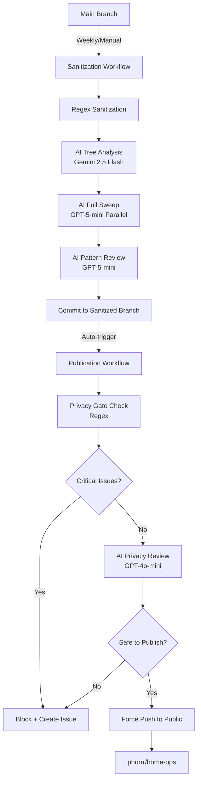

# Sanitization and Public Repository Workflow

This document describes the automated workflow for sanitizing and publishing Kubernetes configurations to a public repository while protecting identity and sensitive information.

## Overview

The publication workflow consists of two stages with multi-layered AI protection:

### Stage 1: Sanitization (Automatic with AI Review)
1. **Regex-based sanitization**: Redacts personal information upfront (names, domains, IPs, timezones)
2. **AI Tree Analysis**: Fast directory scan using Google Gemini 2.5 Flash for suspicious patterns
3. **AI Full Sweep**: Comprehensive file review using GPT-5-mini with parallel processing
4. **AI Pattern Review**: Validates regex-flagged findings using GPT-5-mini for context
5. **Commit**: Pushes sanitized content to `sanitized` branch in private repository
6. **Auto-trigger**: Automatically triggers publication workflow on success

### Stage 2: Publication (Automatic with Privacy Gate)
1. **Privacy Gate Check**: Regex-based verification for identity leaks (CRITICAL failures block publication)
2. **AI Privacy Review**: Context-aware assessment using GPT-4o-mini via OpenRouter
3. **Publication**: If checks pass, force-pushes history-less snapshot to public repository
4. **Issue Creation**: On failure, creates GitHub issue with detailed findings for remediation

## Architecture



## Components

### 1. Sanitization Scripts
- **`sanitize-fast.sh`**: Main sanitization using ripgrep with upfront redaction
- **`ai-tree-analysis.py`**: Fast directory structure analysis (Gemini 2.5 Flash)
- **`ai-full-sweep.py`**: Comprehensive file review with parallel processing (GPT-5-mini)
- **`ai-review.py`**: Pattern validation for flagged findings (GPT-5-mini)
- **`config.yaml`**: Configurable directory inclusions/exclusions

### 2. Publication Scripts
- **`privacy-gate-check.sh`**: Regex-based verification for identity leaks
- **`ai-privacy-review.py`**: Context-aware AI review (GPT-4o-mini via OpenRouter)

### 3. GitHub Workflows
- **`sanitize.yaml`**: Three-stage AI sanitization + commit to `sanitized` branch
- **`publish-sanitized.yaml`**: Auto-triggered publication with privacy gate

### 4. Repositories and Branches
- **Private repo `main`**: Source branch with all configurations
- **Private repo `sanitized`**: Orphan branch with sanitized content
- **Public repo `phorrr/home-ops`**: History-less public repository

## Privacy Protection

### Identity Protection

The privacy gate blocks publication if ANY identity-related patterns are found. All checks are case-insensitive and scan directories configured in `config.yaml`:
- `kubernetes/` - All Kubernetes manifests
- `ansible/` - Ansible playbooks and roles
- `bootstrap/` - Bootstrap scripts
- `docs/` - Documentation

### Upfront Sanitization (Regex-Based)

The following types of information are automatically redacted BEFORE AI review:

| Type | Purpose |
|------|---------|
| Personal domains | Hide infrastructure domains |
| Personal names | Remove identity |
| GitHub URLs | Anonymize repositories |
| Timezone | Hide approximate location |
| Infrastructure IPs | Protect network topology |
| Public IPs | Hide public endpoints |

### Privacy Gate Detection

The privacy gate scans for:

| Type | Action |
|------|--------|
| Identity leaks | **BLOCK** (CRITICAL) |
| Infrastructure IPs | **BLOCK** (CRITICAL) |
| Timezones | **BLOCK** (CRITICAL) |
| Emails | **BLOCK** (except noreply/examples) |
| IP Addresses | Warning (unless in safe ranges) |
| Domains | Warning (unless using variables) |
| Secrets | **BLOCK** |
| Tokens | **BLOCK** |

### Safe Patterns

These patterns are NOT flagged:
- **Variable substitutions**: `${VARIABLE_NAME}` format
- **External Secrets references**: `secretRef`, `externalSecret`, `ClusterSecretStore`
- **Public registries**: `ghcr.io`, `docker.io`, `quay.io`
- **RFC5737 test IPs**: `REDACTED_PUBLIC_IP/24`, `REDACTED_PUBLIC_IP/24`, `REDACTED_PUBLIC_IP/24`
- **Safe localhost**: `127.0.0.1`, `REDACTED_PUBLIC_IP`, `::1`
- **Kubernetes service CIDRs**: Common K8s service IP ranges
- **Public DNS resolvers**: `REDACTED_PUBLIC_IP`, `REDACTED_PUBLIC_IP`, `REDACTED_PUBLIC_IP`, `REDACTED_PUBLIC_IP`, `REDACTED_PUBLIC_IP`
- **Public identity**: Public GitHub usernames
- **No-reply emails**: `users.noreply.github.com`, `noreply@github.com`
- **Generic timezones**: `UTC`, `GMT`
- **Placeholder domains**: `.svc.cluster.local`, `example.com`, `example.org`

## Setup Instructions

### 1. Create Public Repository

Create a public repository under your public identity account:

```bash
# Authenticate as public identity
gh auth login

# Create public repository
gh repo create phorrr/home-ops \
  --public \
  --description "Home operations repository with k3s, k3d on Unraid, and Flux" \
  --clone=false
```

### 2. Create Personal Access Token

1. Go to [GitHub Settings > Tokens](https://github.com/settings/tokens/new)
2. Create a fine-grained token with:
   - **Repository access**: Only the public repository
   - **Permissions**:
     - Contents: Read and write
     - Metadata: Read

### 3. Add Repository Secret

Add the PAT as `PUBLIC_REPO_TOKEN` in your **private** repository:

```bash
# In your private repository
gh secret set PUBLIC_REPO_TOKEN --body "REDACTED_TOKEN"
```

### 4. Add OpenRouter API Key

For AI-powered privacy review (required for all AI stages), add OpenRouter API key:

```bash
# Get your API key from https://openrouter.ai/keys
gh secret set OPENROUTER_API_KEY --body "REDACTED_API_KEY"
```

The sanitization workflow uses multiple AI models via OpenRouter:
- **Tree Analysis**: Google Gemini 2.5 Flash
- **Full Sweep**: OpenAI GPT-5-mini
- **Pattern Review**: OpenAI GPT-5-mini
- **Privacy Review**: OpenAI GPT-4o-mini

## Workflow Operation

### Automatic Sanitization

The sanitization workflow can run:
- **Automatically**: Weekly on Sunday at 2 AM UTC
- **Manually**: Via workflow dispatch

```bash
# Trigger sanitization manually
gh workflow run sanitize.yaml

# Dry run (test without committing)
gh workflow run sanitize.yaml -f dry_run=true
```

### Automatic Publication

Publication is **automatically triggered** after successful sanitization:

1. **Automatic**: Triggered by successful sanitization workflow completion
2. **Manual**: Can be triggered manually via workflow dispatch if needed

```bash
# Manual trigger (if needed)
gh workflow run publish-sanitized.yaml

# Dry run (test without pushing)
gh workflow run publish-sanitized.yaml -f dry_run=true

# Skip privacy check (NOT RECOMMENDED)
gh workflow run publish-sanitized.yaml -f skip_privacy_check=true
```

### Privacy Gate Process

When publication is triggered (automatically or manually):

1. **Automated Scans**: Checks for identity leaks, hardcoded secrets, IPs, emails
2. **AI Privacy Review**: Context-aware assessment using GPT-4o-mini via OpenRouter
3. **Gate Decision**:
   - ✅ **Pass**: Content is published to public repository
   - ⚠️ **Pass with warnings**: Review warnings, proceed if acceptable
   - ❌ **Fail**: Publication blocked, GitHub issue created

### History-less Publishing

Each publication creates a **fresh snapshot** with no history:
- Creates orphan commit (no parent)
- Force pushes to public repository
- Completely replaces previous history
- Prevents historical data leakage

All commits use the public identity:
- Author: `phorrr <phorrr@users.noreply.github.com>`
- Committer: `phorrr <phorrr@users.noreply.github.com>`

## Pre-Publication Checklist

The automated sanitization and privacy gate handle most checks, but verify:

- [ ] No hardcoded IP addresses (except safe ranges)
- [ ] No internal domain names (use `${INTERNAL_DOMAIN}`)
- [ ] No API keys or secrets (use External Secrets)
- [ ] No personal information (names, usernames, emails)
- [ ] No identity references (personal names, domains, usernames)
- [ ] No timezone references that reveal location
- [ ] Cluster names are generic
- [ ] External Secrets properly referenced
- [ ] Variables used instead of hardcoded values

### If Sensitive Data is Published

1. **Immediately remove from public repository**:
   ```bash
   # Clone public repo
   git clone https://github.com/phorrr/home-ops
   cd home-ops

   # Remove sensitive content
   git rm [sensitive-file]
   git commit -m "chore: remove sensitive data"
   git push --force
   ```

2. **Rotate any exposed secrets**:
   - Change passwords, API keys, tokens
   - Update secrets in 1Password
   - Verify External Secrets are synced

3. **Update sanitization rules**:
   - Add patterns to `.github/sanitization/patterns.txt`
   - Test locally with `sanitize-fast.sh`
   - Run full workflow to verify

4. **Document incident**:
   - Create GitHub issue
   - Document what leaked
   - Document prevention steps

### If Identity is Leaked

If privacy gate fails or identity is found in public repo:

1. **DO NOT** merge or publish
2. Review the privacy gate check output
3. Fix all identity references in source repository
4. Re-run sanitization
5. Verify with `grep -ri "pattern" kubernetes/` locally
6. Re-run privacy gate before publishing

## Monitoring

### Workflow Status

```bash
# View recent sanitization runs
gh run list --workflow=sanitize.yaml

# View recent publication runs
gh run list --workflow=publish-sanitized.yaml

# View detailed logs
gh run view [run-id] --log
```

### Privacy Gate Reports

Privacy gate failures create GitHub issues automatically. Review:
- Issue title indicates what was found
- Issue body contains detailed findings
- Workflow artifacts contain full reports

### Public Repository Health

Periodically verify:
- No sensitive data visible
- No identity references
- README is current
- Configs are usable by community
- License is present

## Troubleshooting

### Common Issues

#### Privacy Gate Fails

**Symptoms**: Publication blocked, issue created

**Solutions**:
1. Review the created GitHub issue for specific findings
2. Download workflow artifacts for full report
3. Fix issues in source repository
4. Re-run sanitization
5. Re-run publication with privacy gate

#### Sanitization Fails

**Symptoms**: Workflow errors, no commit to `sanitized` branch

**Solutions**:
1. Check workflow logs: `gh run view --log`
2. Test locally: `bash .github/sanitization/sanitize-fast.sh`
3. Verify ripgrep is installed
4. Check pattern syntax in `patterns.txt`

#### AI Review Timeout

**Symptoms**: AI review step fails or times out

**Solutions**:
1. Verify `OPENROUTER_API_KEY` is set and valid
2. Check OpenRouter API status (https://openrouter.ai/status)
3. Review workflow logs for specific AI model errors
4. Temporarily skip AI review: `gh workflow run publish-sanitized.yaml -f skip_privacy_check=true` (review manually)

**Note**: The workflow uses multiple AI models (Gemini 2.5 Flash, GPT-5-mini, GPT-4o-mini). Check which specific model is failing in the logs.

#### Public Repository Push Fails

**Symptoms**: Git push errors in workflow

**Solutions**:
1. Verify `PUBLIC_REPO_TOKEN` secret is set
2. Check token has write permissions
3. Verify public repository exists
4. Check repository name matches workflow configuration

### Debug Commands

```bash
# Test sanitization locally
bash .github/sanitization/sanitize-fast.sh

# Check sanitization output
ls -la /tmp/sanitized/

# Review sanitization report
cat /tmp/sanitized/sanitization-report.json | jq '.issues[] | select(.severity == "high")'

# Test privacy patterns locally (replace with your identity patterns)
grep -ri "your-username\|your-name\|your-domain" kubernetes/ docs/

# Check for hardcoded IPs
grep -rE '\b([0-9]{1,3}\.){3}[0-9]{1,3}\b' kubernetes/ | \
  grep -v '127.0.0.1\|REDACTED_PUBLIC_IP\|10.30\|10.31\|192.0.2\|198.51.100\|203.0.113'
```

## Maintenance

### Regular Tasks

- **Weekly**: Review sanitization output after automatic runs
- **Before each publication**: Review privacy gate results
- **Monthly**: Spot-check public repository for any issues
- **Quarterly**: Rotate PAT token
- **Yearly**: Review and update detection patterns

### Updating Patterns

To add new detection patterns:

1. Edit `.github/sanitization/patterns.txt`
2. Test locally: `bash .github/sanitization/sanitize-fast.sh`
3. Review output for false positives
4. Commit pattern updates
5. Run full workflow to verify

### Token Rotation

Rotate PAT every 3 months:

1. Create new token with same permissions
2. Update secret: `gh secret set PUBLIC_REPO_TOKEN`
3. Test publication workflow
4. Revoke old token

## Best Practices

1. **Never commit sensitive data to main branch** - Use External Secrets from the start
2. **Use variables for all environment-specific values** - `${INTERNAL_DOMAIN}`, etc.
3. **Review privacy gate output carefully** - Don't skip checks
4. **Test patterns locally before committing** - Faster feedback loop
5. **Document exceptions** - If you must whitelist a pattern, document why
6. **Monitor public repository** - Set up alerts for new issues
7. **Rotate secrets regularly** - Even if not exposed, rotate quarterly

## Contributing

To improve the sanitization and privacy protection:

1. **Test locally first**: Use `sanitize-fast.sh` and privacy checks
2. **Document patterns**: Explain why new patterns are needed
3. **Test full workflow**: Run end-to-end before proposing changes
4. **No identity in PRs**: Ensure your own identity is protected

## License

The sanitized configurations are published under MIT License for community use.